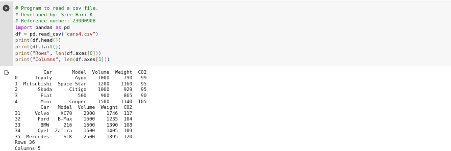

## Read-from-CSV
## AIM:
To write a program to read a csv file.
ALGORITHM:
## Step 1:
Import pands module as pd.
## Step 2:
Read a csv file name cars.csv.
## Step 3:
Print the first five rows and last five rows.
## Step 4:
Print the length of the rows and columns.
## step 5:
End the program.
## PROGRAM:
```python
# Program to read a csv filE
# Developed by: Sree hari K
# Reference number: 23000908.
import pandas as pd
df = pd.read_csv("cars.csv")
print(df.head())
print(df.tail())
print("Rows", len(df.axes[0]))
print("Columns", len(df.axes[1]))
```
## OUTPUT:


## RESULT:
Thus the program is written to read a csv file.